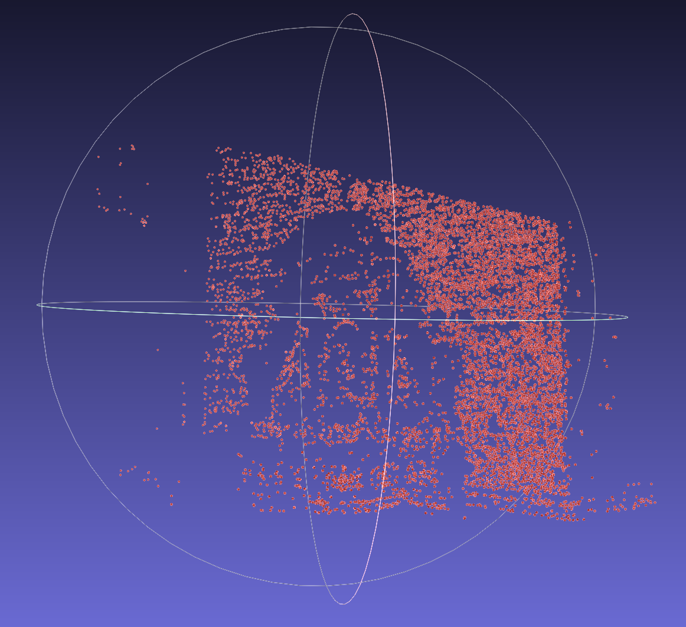

# Structure From Motion
Repository for the module#3 of ThinkAutonomous' 3D Computer Vision program: https://www.thinkautonomous.ai/courses

This workshop outlines the step-by-step process of performing 3D reconstruction from multiple 2D images by matching feature points, estimating epipolar geometry, recovering camera motion (rotation and translation), and triangulating the data into a three-dimensional model.

